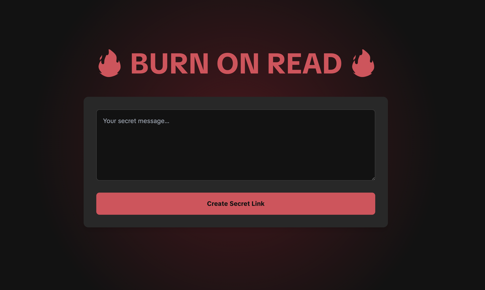

# 🔥 Burn On Read 🔥

This project is a "burn on read" service, a web application that securely creates self-destructing messages. A message is generated, a unique link is created, and the content is permanently deleted from the server immediately after being viewed once. It was developed as a practical exercise for the Advanced Web Development course at Spiced Academy (AWD25).

The core challenge was to build a secure, stateful web application where the state (the message file) is intentionally ephemeral. This involved handling file system operations asynchronously, generating unique, unguessable identifiers for messages, and ensuring that the data is destroyed atomically upon a single read.

You can see the live version of the project here:

**[Burn On Read](https://burn-on-read-production.up.railway.app)**

# Key Concepts Demonstrated

- **Server-Side Rendering (SSR):** Using Express to render dynamic HTML pages on the server.
- **Asynchronous Filesystem Operations:** Securely writing, reading, and deleting files using Node.js fs/promises.
- **Custom Middleware:** Building a custom access logger to monitor all incoming requests.
- **Dynamic Routing:** Creating routes in Express to serve individual messages based on a unique ID.
- **Template Inheritance & Macros:** Using a master layout and reusable macros with Nunjucks to follow the DRY principle.
- **Ephemeral Data Storage:** Managing data that is designed to exist for only a single transaction.

# Tech Stack

- **Backend:** Node.js, Express.js, TypeScript
- **Template Engine:** Nunjucks
- **Frontend:** HTML, Tailwind CSS, Vanilla JS
